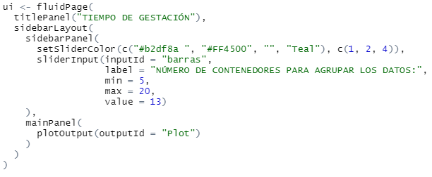
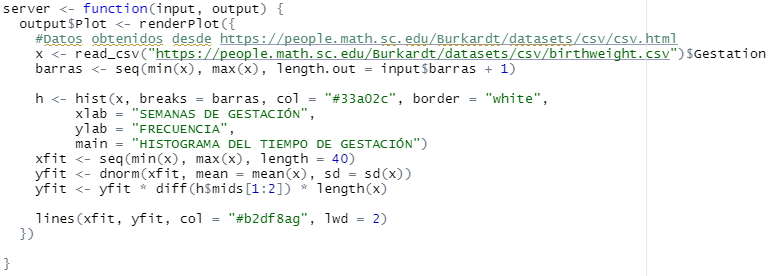

```{r setup, include=FALSE}
knitr::opts_chunk$set(echo = TRUE)
```

## Librerías utilizadas

- library(shiny) : Es un framework de RStudio para construir aplicaciones web en R.
- library(shinyWidgets) =  Extiende la capacidad de Shiny con aplicaciones más avanzadas en las definiciones visuales.
- library(tidyverse) : Tidyverse es una colección de paquetes disponibles en R y orientados a la manipulación, importación, exploración y visualización de datos y que se utiliza exhaustivamente en ciencia de datos. Aquí utilizamos la función read_csv() para la obtención de datos del estudio en línea,

## UI
- En la UI se definen los despliegues de información al usuario, para ello se utilizan dos paneles.
- La interfaz de usuario permite que se despliegue un "sidebarPanel" para que el usuario defina la cantidad de contenedores o barras que contendrá el histograma que se desplegará en el main panel. La variable inputId almacena esta cantidad.


## SERVER
- En el Server se realizan las obtenciones de datos y cálculos de las distintas variables utilizadas.
- En el Server se realiza la obtención de los datos de gestación desde el sitio desde https://people.math.sc.edu/Burkardt/datasets/csv/csv.html. Para ello utiliza la función read_csv() y almacena la información en el dataframe x.
- Además genera un dataframe h del histograma a desplegar utilizando la función hist().
- También genera los dataframe xfit y yfit utilizando las funciones seq() y dnorm() para luego generar la curva de distribución Normal utilizando la función lines().



## SHINY
- La función shinyApp() permite que la interfaz UI interactue con el Server permitiendo los cálculos y despliegues.

shinyApp(ui = ui, server = server)