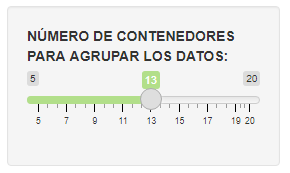
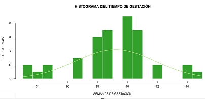

```{r setup, include=FALSE}
knitr::opts_chunk$set(echo = FALSE)
```


## Datos del estudio

- Los datos del estudio son obtenidos directamente desde el enlace: https://people.math.sc.edu/Burkardt/datasets/csv/csv.html
- La información del estudio se actualiza cada vez que los datos fuentes sean actualizados.

## Se obtuvo una regresión lineal del periodo de gestación y el peso del bebé
```{r, echo = FALSE, fig.align='center', message = FALSE}
library(tidyverse)
library(plotly)

HP <- read_csv("https://people.math.sc.edu/Burkardt/datasets/csv/birthweight.csv")

Reg<-lm(Birthweight~Gestation,data=HP)

plot_ly(HP,x=~Gestation,y=~Birthweight,type="scatter",mode="markers") %>% add_lines(x=~Gestation,y=fitted(Reg)) %>% layout(title="REGRESIÓN LINEAL DEL PESO VERSUS EL TIEMPO DE GESTACIÓN EN SEMANAS")
```

## Histograma del estudio

- Se puede acceder al histograma en el siguiente enlace: https://widorojas.shinyapps.io/Gestacion/

- Mueva el control deslizante para ajustar el número de contenedores que desee visualizar. 

{witdh=90%}

## Histograma del estudio
- El histograma se actualizará en forma automática y se visualizará la distribución Normal ajustada a los datos.



- Todos los archivos de este estudio los puede obtener desde el repositorio GitHub del proyecto: https://github.com/widorojas/Gestacion.git 
